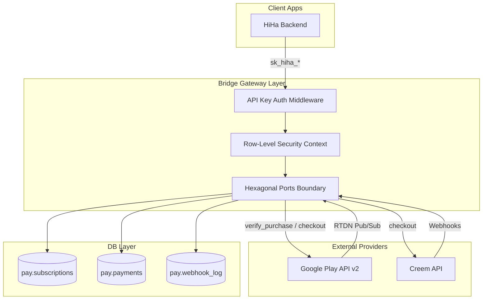

# Development History & Postmortem Analysis: The Bridge Decoupling Split
*Prepared by: Antigravity (Senior Pair Programming Agent)*  
*Date: May 17, 2026*  
*Project Workspace: `C:\share\tyde\bridge`*  
*Analysis Scope: March 19, 2026 – May 17, 2026 (8.4 Weeks / 456 Commits)*

---

## 1. Executive Summary

The decoupling of **Bridge** (`pay.tydecode.com`) from the monolithic backend of the **HiHa** app began on March 19, 2026, with an initial estimate of "a couple of weeks." As of May 17, 2026, the split has spanned **8.4 weeks** and **456 commits**, culminating in a highly stable, secure, multi-tenant billing engine. However, the timeline exceeded the original expectation by a factor of four. 

This postmortem identifies the primary engineering and process factors that drove this delay:

1. **Deceptive Initial Success:** The project achieved basic monolithic extraction within four days, releasing Version 0.1.0 on March 23, 2026. This rapid initial success gave a false sense of simplicity, masking the deep, cross-cutting complexity of multi-tenant security, economic logging, and background workers.
2. **The Hexagonal Architectural Pivot:** The extracted codebase was initially tightly coupled to standard nested-match patterns and naive DB access layers. As payment provider edge cases accumulated, the architecture broke. The team was forced into a complete, unplanned rewrite to **Hexagonal Architecture (Ports & Adapters)** in Version 0.2.0 (April 9, 2026), which absorbed two weeks and over 110 commits.
3. **Enforcing Multi-App Tenant Boundaries (RLS):** To support multiple client apps safely, the database was migrated to PostgreSQL **Row-Level Security (RLS)** in Migration 90. Designing, debugging, and configuring these policies—especially early RLS bootstrap SELECT exceptions for API key resolution and webhook ingress before tenant session context exists—was highly complex and introduced significant "fail-closed" lock issues.
4. **Sandbox Lifecycles vs. Production Realities:** Google Play test environments utilize highly accelerated cadences (e.g., monthly subscriptions renewing every 5 minutes) and reuse purchase tokens. This behavior was not anticipated, leading to a catastrophic deduplication bug where a unique index on `(purchase_token, event_type)` dropped sandbox renewals 2 through 6 as duplicates, preventing premium extensions.
5. **State Machine Integrity & Overwrite Defects:** Naive database upserts in early stages resulted in partial webhook events erasing active subscription data (e.g., erasures of expiration periods or customer identifiers). Resolving this required replacing direct assignments in SQL queries with `COALESCE` updates (Commit `26c5e2fd` on May 16, 2026) to preserve nullable fields.
6. **Underestimation of Economic Auditing (Invariants Violation):** Storing Google purchase tokens directly in `payments.provider_transaction_id` violated the core invariant that this column must represent unique economic transaction/order IDs (like `GPA.3346-...`). This caused a single database row to be overwritten on each renewal, obliterating historical billing records. Plumbed dedicated columns (`provider_purchase_token` in Migration 18) were only added on May 16, 2026, to resolve this.
7. **Severe Automated Integration Test Debt:** High-fidelity testing was deferred. Building the massive automated test suites under `tests/gpbi` (171 files) and `tests/creem` (92 files) was necessary to stabilize the system, but it consumed several weeks of development that should have been planned upfront.
8. **Floating-Point Currency Risks:** The initial split retained the monolithic use of `f64` for dollar amounts. In late April (Commit `39f80c80`), the team realized the catastrophic rounding risks this posed to billing conversions (e.g., `9.99 * 100.0` parsing to `998` cents) and refactored the entire system to strict integer-cent arithmetic.

---

## 2. Timeline by Phase

The 8.4-week history is categorized into four distinct chronological phases defined by version tags, commit intensity, and major technical challenges:

```mermaid
gantt
    title Bridge Decoupling Split Timeline (2026)
    dateFormat  YYYY-MM-DD
    section Phases
    Phase 1: Bootstrapping & Monolithic Decoupling   :active, p1, 2026-03-19, 2026-03-28
    Phase 2: Architectural Pivot (Hexagonal)       :crit, p2, 2026-03-29, 2026-04-09
    Phase 3: Integration & Test Expansion           :p3, 2026-04-10, 2026-05-09
    Phase 4: Production Stabilization & Edge Cases   :active, p4, 2026-05-10, 2026-05-17
```

### Phase 1: Bootstrapping & Monolithic Decoupling (March 19 – March 28, 2026)
* **Commit Count:** 59 commits (13% of total)
* **Primary Focus:** Extracting core handlers and services from the old HiHa backend. Establishing the basic Axum server structure, the initial migrations (00–06), and preliminary payment integration modules for Google Play, Creem, and Coinbase.
* **Milestones:** Version 0.1.0 (March 23) as the initial gateway release; immediate hotfixes 0.1.1 and 0.1.2 (March 28) to resolve basic endpoint routing gaps.
* **Instability & Risks:** High architectural fragility. Handlers were tightly coupled to specific SQL queries. No multi-tenant boundary checks or webhook signature verification checks were active.

### Phase 2: Architectural Pivot — Hexagonal Re-engineering (March 29 – April 9, 2026)
* **Commit Count:** 153 commits (34% of total) — Peak churn period
* **Primary Focus:** Massive, unplanned re-architecting to Hexagonal Architecture (Ports and Adapters) in `src/ports.rs` to isolate provider APIs and enable mock-mode testing. Implementing PostgreSQL Row-Level Security (RLS) across all tables for multi-tenant isolation.
* **Milestones:** Version 0.2.0 (April 9) marking the complete architectural migration and removal of legacy `ENCRYPTION_KEY` dependencies.
* **Instability & Risks:** Severe database connection blocks and query failures due to RLS "fail-closed" constraints. Mid-phase log messages show high thrashing (e.g., `"reverted to semi-initial state"` and `"hexa fixes 7"`).

### Phase 3: Integration Expansion & Automated Test Debt (April 10 – May 9, 2026)
* **Commit Count:** 197 commits (43% of total)
* **Primary Focus:** Resolving the lack of automated test coverage by developing large, robust integration test runners and shell scripts. Refactoring Coinbase/Google Play/Checkout flows from floating-point currency to integer cents. Wiring background workers (pause scheduler, cleanup job) and transactional lifecycle email dispatches.
* **Milestones:** Version 0.3.0 (May 9) with full lifecycle email dispatches, list API enhancements, and removal of dead/unsupported Coinbase and LemonSqueezy code.
* **Instability & Risks:** Intermittent webhook timeouts. Discovery of race conditions during Google Play RTDN (Real-Time Developer Notification) processing, where Google sends webhooks before client apps register purchase tokens.

### Phase 4: Production Stabilization & Edge Cases (May 10 – May 17, 2026)
* **Commit Count:** 49 commits (10% of total)
* **Primary Focus:** Surgical fixing of critical, late-discovered Google Play billing gaps. Resolving Pub/Sub audience verification blocks, supporting unwrapped Pub/Sub payloads, implementing the 3-day acknowledgement retry scheduler, and executing the "BIG FIX" to resolve sandbox renewal deduplication and payment overwrites.
* **Milestones:** Version 0.3.1 (May 14) and hotfixes on May 16-17.
* **Instability & Risks:** Stabilization is successfully achieved as of yesterday's major fixes, with active thrashing reduced to minor edge cases identified in today's manual testing.

---

## 3. What Changed Technically

The technical footprint of the decoupling is vast, replacing simple pass-through endpoints with highly standardized, resilient, and multi-tenant subsystems.



### 3.1 Webhook Ingress & Processing
* **Changes:** Shifted from naive webhook routing to an obfuscated UUID-token ingress path (`/webhooks/{token}/:provider`) configured per-app. Signature verification was enforced using provider-specific cryptographic signatures (HMAC-SHA256 for Creem; Google RSA JWT audience verification for Google Play).
* **Key Files:** [ingress.rs](file:///C:/share/tyde/bridge/src/webhooks/ingress.rs), [processor.rs](file:///C:/share/tyde/bridge/src/webhooks/processor.rs)
* **Evidence:** Commit `86ea56ca` disabled standard jsonwebtoken audience checks to explicitly validate Google’s custom Pub/Sub `aud` claims and process payload-unwrapped notifications.

### 3.2 Subscription Lifecycle
* **Changes:** Canonicalized all provider subscription states into a typed Rust enum (`active`, `trial`, `paused`, `cancelled`, `expired`, `revoked`). Introduced optimistic concurrency tracking (`version` column) and stale-event suppression by comparing webhook event timestamps (`timestamp_epoch_ms`) against `subscriptions.last_event_time`.
* **Key Files:** [subscriptions.rs (DB)](file:///C:/share/tyde/bridge/src/db/subscriptions.rs), [product_lifecycle.rs](file:///C:/share/tyde/bridge/src/services/google_play/product_lifecycle.rs)
* **Evidence:** Commit `26c5e2fd` updated `upsert_subscription_tx` to use SQL `COALESCE` statements, preventing partial lifecycle events from wiping out existing nullable metadata.

### 3.3 Payment Records
* **Changes:** Strictly segregated economic transaction histories from purchase tokens. Replaced f64 arithmetic with integer cents, executing currency conversions purely at API boundaries. Enforced atomic payment upserts to prevent double-charging or fraud attempts.
* **Key Files:** [payments.rs (DB)](file:///C:/share/tyde/bridge/src/db/payments.rs), [payment.rs (Service)](file:///C:/share/tyde/bridge/src/services/payment.rs)
* **Evidence:** Migration 18 (`18_add_payment_provider_purchase_token.sql`) added `provider_purchase_token` to decouple economic transaction order IDs from Google lifecycle handles.

### 3.4 Google Play Integration
* **Changes:** Upgraded the integration client to the Google Play Developer API v2. Engineered price step-up (Korea-specific consent) workers, 3-day purchase acknowledgement checks (to prevent automatic refunds), and obfuscated user linking.
* **Key Files:** [client.rs](file:///C:/share/tyde/bridge/src/services/google_play/client.rs), [notifications.rs](file:///C:/share/tyde/bridge/src/services/google_play/notifications.rs)
* **Evidence:** Commit `26c5e2fd` updated Google Play v2 webhook parsing to extract renewal expiry directly from `lineItems[].expiryTime` when the top-level `expiryTime` is missing.

### 3.5 Creem Integration
* **Changes:** Configured per-app checkout validation. Mapped Creem webhooks (e.g., `refund.created` and `payment.failed`) to Bridge canonical states.
* **Key Files:** [creem.rs](file:///C:/share/tyde/bridge/src/services/creem.rs)
* **Evidence:** Commit `3371d24` added per-app configurable stale payment windows to automatically release expired Creem checkout holds.

### 3.6 One-Time Purchases (OTP)
* **Changes:** Integrated verification loops. Supported pending mobile one-time purchases with HTTP 202 response codes and asynchronous background polling.
* **Key Files:** [verify_purchase.rs (Handler)](file:///C:/share/tyde/bridge/src/handlers/verify_purchase.rs), [verify_purchase.rs (App)](file:///C:/share/tyde/bridge/src/application/verify_purchase.rs)
* **Evidence:** Commit `5a90d3a9` implemented RLS-safe terminal payment state checks to block late verification retries from downgrading already approved OTP purchases.

### 3.7 Background Workers & Email Services
* **Changes:** Wired daily reconciliation engines to self-heal state drift against provider APIs. Integrated exponential backoff callback forwarding (3-strike retry) with dead-letter queueing. Configured Clerk and Resend email dispatchers to alert users of lifecycle events (pauses, refunds, payment failures).
* **Key Files:** [scheduler.rs](file:///C:/share/tyde/bridge/src/webhooks/scheduler.rs), [forwarding.rs](file:///C:/share/tyde/bridge/src/webhooks/forwarding.rs)
* **Evidence:** Migration 16 (`16_add_webhook_delivery_dead_letter_state.sql`) added explicit `dead_lettered` state columns to `pay.webhook_delivery` for delivery failure analysis.

---

## 4. Repeated Churn Areas

A review of the files repeatedly modified across the 456 commits reveals the primary zones of technical friction and architectural uncertainty:

| Churn Count | File Path | Defect/Uncertainty Pattern | Normal Extraction vs. Process Failure |
|:---:|---|---|---|
| **59** | `src/webhooks/processor.rs` | Continual struggle with provider event mapping, stale suppression, and user identification logic. | **Process Failure:** Absence of a detailed, written behavioral spec in Phases 1 & 2 forced reactive bug-fixing as edge cases emerged. |
| **37** | `src/db/subscriptions.rs` | Schema changes and SQL query tuning to enforce multi-tenant RLS, concurrency checks, and metadata preservation. | **Normal Extraction:** Natural consequence of shifting to multi-app design and adding optimistic locking. |
| **37** | `src/webhooks/ingress.rs` | Security, signature verification, custom JWT audience checks, and payload-unwrapping tweaks. | **Normal Extraction:** Typical overhead associated with adapting to complex Google Play Pub/Sub ingress requirements. |
| **32** | `docs.notes/BEHAVIORAL_SPEC_GAPS.md` | Doc Notes | Auditing discrepancies between monolithic behavior and Bridge normalization. | **Process Failure:** Confirms that the target system's invariants were poorly defined, leading to extensive late-phase gap analysis. |
| **28** | `src/webhooks/scheduler.rs` | Background worker loop issues, mock-mode support for ack retries, and pause/resume timing adjustments. | **Normal Extraction:** Standard development overhead for high-availability scheduler components. |
| **23** | `src/handlers/verify_purchase.rs` | OTP handling, async polling, and token registration adjustments. | **Process Failure:** The API boundary was continuously modified due to a lack of early consensus on mobile billing contracts. |

---

## 5. Estimate Failure Analysis

The original estimate of "a couple of weeks" was highly inaccurate. A senior postmortem analysis separates the core contributing factors:

### 5.1 Underestimated Technical Scope
The split was initially conceptualized as a basic "copy-paste" of billing files from HiHa. The team did not anticipate the extensive gateway infrastructure needed to support a stand-alone, production-ready middleware:
* **Tenant Isolation:** Implementing secure, multi-app structures (rather than a hardcoded single database schema) required writing custom RLS policies and early-bootstrap middlewares.
* **Security Layer:** Designing secure signature checkers, HMAC signers for outbound callbacks, and API key hashing routines (Argon2/Bcrypt) added significant complexity.

### 5.2 Unclear Behavioral Invariants
Crucial system boundaries were not documented, resulting in architectural regressions:
* **Economic Identity Mismatch:** Failing to define the difference between a lifecycle token and an economic transaction ID led to the reuse of purchase tokens as payment keys, wiping out renewal logs for weeks.
* **Floating-Point Debt:** Retaining `f64` values in billing models resulted in precision rounding risks, which eventually forced a massive, systemic refactor.

### 5.3 Provider-Specific Sandbox Quirks
The extreme complexity of Google Play Billing was underestimated:
* **Accelerated Lifecycles:** Testing Google subscriptions in sandbox (where renewals happen every 5 minutes) exposed indexing errors that normal 30-day billing cadences would have hidden for weeks.
* **Noisy API Reponse Paths:** Refunded or invalid tokens triggered noisy `410 Gone` errors on the Google subscription API, requiring custom fallback logic to suppress false-positive alarms.

### 5.4 Process Smells in Git History
* **Reactive Commits:** Commit logs in Phase 2 are highly reactive (e.g., `da0ce40 gap fixes`, `5080fd6 gap fixes`, `bf062b4 hexa fixes 7`). This reflects a "fix-on-the-fly" model, where developers iteratively patched code without a unified architectural roadmap.
* **Late Testing Strategy:** High-fidelity test harnesses were built late. Automated regression testing was deferred until after the system structure broke in Phase 2, meaning core defects (such as the renewal deduplication bug) remained hidden until Phase 4.

---

## 6. Quality and Risk Assessment

Based on the git log, database schema, and recent investigative notes, **Bridge is stabilizing rapidly but was in a high-thrashing state until very recently (May 16).**

### 6.1 Indicators of Stabilization
* **Hexagonal Maturity:** Commit volume in Phase 4 is low (49 commits) and focuses on high-precision bug-fixes rather than massive structural refactoring. This indicates that the core Hexagonal architecture (Ports & Adapters) is stable and robust.
* **Regression Protection:** The automated integration test suites (`tests/gpbi` and `tests/creem`) are highly comprehensive, containing over 260 distinct test scripts.
* **Root-Cause Resolution:** The "BIG FIX" (Commit `26c5e2f`) on May 16 successfully resolved the system's most severe issues (Google Play renewal deduplication, payment overwrites, and nullable field loss).

### 6.2 Active Thrashing & Remaining Risks
The manual investigation of Google Play OTP refunds on May 17 (today) reveals three minor, active edge cases that must be addressed:
1. **Duplicate economic records:** One-time product (OTP) refunds currently insert a duplicate payment row in `pay.payments` using the purchase token as `provider_transaction_id`, violating the economic transaction ID invariant.
2. **Dual Callback Dispatch:** A single Google Play OTP refund emits both `ONE_TIME_PRODUCT_REFUNDED` and `VOIDED_PURCHASE` webhooks, which Bridge forwards as dual callbacks to HiHa, causing semantic duplicate noise.
3. **Noisy Error Logs:** OTP webhook processing triggers unnecessary subscription API calls, causing noisy but harmless `410 Gone` errors in the application logs.

---

## 7. Lessons Learned

Before initiating future monolithic splits or architectural extractions, the following engineering and process guidelines should be established:

1. **Document Domain Invariants First:** Write out strict system invariants (e.g., pure integer cents, economic transaction ID definitions, multi-app database boundaries) *before* writing any code.
2. **Enforce Port Boundaries from Day One:** If a service integrates with multiple third-party APIs, adopt Hexagonal Architecture (Ports and Adapters) on day one. Starting with a nested monolith-style design and refactoring later adds massive complexity and delay.
3. **Build High-Fidelity Mock Test Suites Early:** Establish an automated integration test runner (such as `tests/gpbi`) in the first week. Sandbox test behaviors (like 5-minute renewals) must be modeled and simulated locally to identify deduplication and state-machine flaws early.
4. **Treat Multi-App Isolation as a Core Constraint:** Do not build a single-tenant backend with the plan to "add multi-tenancy later." Scoping databases, RLS policies, and API key resolutions must be treated as foundational architecture.

---

## 8. Recommendations Going Forward

The following tasks are recommended to transition Bridge from its current release (v0.3.1) to a production-ready payment processing gateway.

### 8.1 Short-Term Actions (Next 1–2 Weeks)

#### Task 1: Implement the "Smallest Safe Fix" for Initial Payments
* **Objective:** Resolve database schema inconsistencies on the initial subscription payment created by `verify_purchase`.
* **Action:**
  1. In `commit_verified_purchase`, set `product_id = Some(subscription_id)` (currently `None`).
  2. Keep the initial Google subscription payment row token-keyed (do not switch `provider_transaction_id` to `latestOrderId` in `verify_purchase`).
  3. Special-case the `SUBSCRIPTION_PURCHASED` webhook event to upsert directly into the same token-keyed payment row.
  4. Ensure renewal webhooks continue to write distinct `GPA.xxx` order-keyed rows.

#### Task 2: Fix Google Play OTP Refund Gaps
* **Objective:** Address issues identified in the May 17 investigation.
* **Action:**
  1. Parse Google's `oneTimeProductNotification` and `voidedPurchaseNotification.productType = 2` as OTP-specific events before applying subscription enrichment workflows.
  2. Suppress calls to `get_subscription` for these OTP-specific webhooks to eliminate noisy `410 Gone` errors.
  3. Update OTP refund processors to update existing payments by `provider_purchase_token` instead of inserting duplicate rows keyed by purchase token.
  4. Filter out duplicate app callbacks, sending only a single `purchase.one_time` callback with `status = refunded`.

### 8.2 Medium-Term Actions (Before Production Release)

#### Task 3: Complete Schema-Backed Transaction ID Decoupling
* **Objective:** Clean up the payment database model so all payment rows are consistently order-keyed.
* **Action:**
  1. Execute a database migration to add a dedicated `provider_purchase_token` column to `pay.payments`.
  2. Migrate old rows to ensure `provider_transaction_id` contains only true order IDs.
  3. Refactor the acknowledgement retry scheduler, manual acknowledgement endpoints, and refund processes to query by `provider_purchase_token` instead of using token-overloaded `provider_transaction_id` checks.

#### Task 4: Continuous Verification & Observability
* **Objective:** Ensure early warning for database and webhook regressions.
* **Action:**
  1. Configure a recurring test run using sandbox subscriptions to live-verify that a 7-order sequence generates 7 distinct, non-overlapping `pay.payments` records.
  2. Add active observability alerts to monitor the count of `dead_lettered` webhook callbacks and RLS validation errors in application logs.
  3. Integrate an automated configuration auditor to verify that rate limits and signature checking flags (`verify_webhook_signature`) are properly synced.

---

## 9. Appendix

### 9.1 Key Commands Used during Analysis
```bash
# Count total commits since split inception
git rev-list --count --since="2026-03-19 00:00:00" HEAD

# List tags in chronological order
git tag --sort=creatordate

# Find commits relating to currency refactoring and RLS
git log --grep="cents" --grep="f64" --grep="hexagonal" --grep="ports" --oneline

# Inspect files changed in the major currency refactor
git show --stat 39f80c806cd12e75355efcf5fe23e068befebdf9

# Inspect files changed in the major renewal/deduplication fix
git show --stat 26c5e2fdbae0c447b7c589ed2e250f8147dc07b8
```

### 9.2 Commits Per Week (Monday – Sunday)
The following table shows commit activity since the split began:

| Week Start | Week End | Commits | Key Activities / Milestones |
|---|---|:---:|---|
| **2026-03-16** | 2026-03-22 | 37 | Decoupling inception (Mar 19); initial table migrations. |
| **2026-03-23** | 2026-03-29 | 26 | Release v0.1.0 (Mar 23); initial hotfixes v0.1.1 and v0.1.2 (Mar 28). |
| **2026-03-30** | 2026-04-05 | 52 | Early port-boundary drafting; multi-app configuration testing. |
| **2026-04-06** | 2026-04-12 | 110 | **Peak Pivot:** Complete Hexagonal Architecture migration & RLS release v0.2.0. |
| **2026-04-13** | 2026-04-19 | 49 | Post-pivot stabilization; RLS fail-closed hotfixes; initial tests added. |
| **2026-04-20** | 2026-04-26 | 77 | Pure integer-cents refactor; GPBI and Creem test expansions. |
| **2026-04-27** | 2026-05-03 | 20 | Background pause workers wired; manual retry dashboards. |
| **2026-05-04** | 2026-05-10 | 46 | Release v0.3.0 (May 9); transactional email integrations; LemonSqueezy removal. |
| **2026-05-11** | 2026-05-17 | 39 | Release v0.3.1 (May 14); pending OTP billing fixes; major sandbox renewal fixes. |

### 9.3 Top Changed Files (Churn)
The 10 most frequently modified files in the codebase since March 19, 2026:

| Edit Count | File Path | Scope / Module | Primary Reason for Churn |
|:---:|---|---|---|
| **59** | `src/webhooks/processor.rs` | Webhook Processor | Custom provider webhook parsing, stale event suppression. |
| **37** | `src/db/subscriptions.rs` | DB Layer | SQL query updates for RLS, optimistic versioning, nullable preservation. |
| **37** | `src/webhooks/ingress.rs` | Webhook Ingress | Signature validation, JWT audience parsing, unwrapped payloads. |
| **32** | `docs.notes/BEHAVIORAL_SPEC_GAPS.md` | Doc Notes | Auditing discrepancies between monolith and decoupled gateway. |
| **28** | `src/webhooks/scheduler.rs` | Webhook Scheduler | Background workers, retry delays, paused/resumed event processing. |
| **26** | `src/main.rs` | System Entrypoint | Router setup, middleware pipeline configurations. |
| **23** | `src/handlers/verify_purchase.rs` | HTTP Handlers | Mobile verify token endpoints, async billing polls. |
| **23** | `docs.notes/BEHAVIORAL_SPEC_AUDIT.md` | Doc Notes | Gap tracking and status validation notes. |
| **22** | `src/handlers/subscriptions_actions.rs` | HTTP Handlers | Actions on subscriptions (price increases, pauses, cancellations). |
| **21** | `src/application/verify_purchase.rs` | App Layer | Purchase verification orchestrator, acknowledgement checks. |

### 9.4 Top Changed Directories
Total number of file edits within each major directory:

| Edit Count | Directory Path | Purpose |
|:---:|---|---|
| **865** | `tests` | Automated testing suites (unit, integration, and regression). |
| **802** | `src` | Gateway application source code. |
| **519** | `tests/gpbi` | Automated integration scripts for Google Play. |
| **338** | `tests/creem` | Automated integration scripts for Creem. |
| **230** | `docs.notes` | Engineering postmortems, gap trackers, and investigations. |
| **184** | `src/webhooks` | Ingress, processors, schedulers, and delivery workers. |
| **138** | `src/handlers` | HTTP API request orchestration layers. |
| **111** | `src/services` | External payment API client modules. |
| **109** | `src/db` | Pure database SQL query layers. |

### 9.5 Representative Commits per Theme
Examples of commits defining major project themes:

* **Hexagonal Pivot (Phase 2):**
  * `c084dff` - *hexagonal refactor fix*
  * `a73f108` - *hexa rewrite: webhook port refactor*
  * `3a706cc` - *hexa rewrite: Google lifecycle refactor*
  * `e2b1dac` - *ports cleanup - BridgeRepository umbrella open; removed to smaller parts*
* **Security & RLS boundaries (Phase 2):**
  * `1d640c7` - *docs updated for RLS*
  * `90_enable_row_level_security.sql` (Migration) - *Enables Row-Level Security for multi-app isolation.*
  * `91_fix_rls_current_app_id_cast.sql` (Migration) - *Resolves type-casting failures in bootstrap SELECTs.*
* **Integer Cent Refactoring (Phase 3):**
  * `39f80c8` - *FIX (currency): Replace f64 arithmetic with integer-cent parsing and formatting*
* **Production Stabilization (Phase 4):**
  * `5a90d3a` - *FIX (payments): Prevent OTP status downgrades after approval*
  * `e473e00` - *FIX (google-play): Respect mock mode for acknowledgement retries*
  * `86ea56c` - *FIX (google-play): Validate Pub/Sub audience and accept test notifications*
  * `26c5e2f` - *BIG FIX (google-play): Preserve renewal webhooks and payment records*

---
*End of Analysis.*
