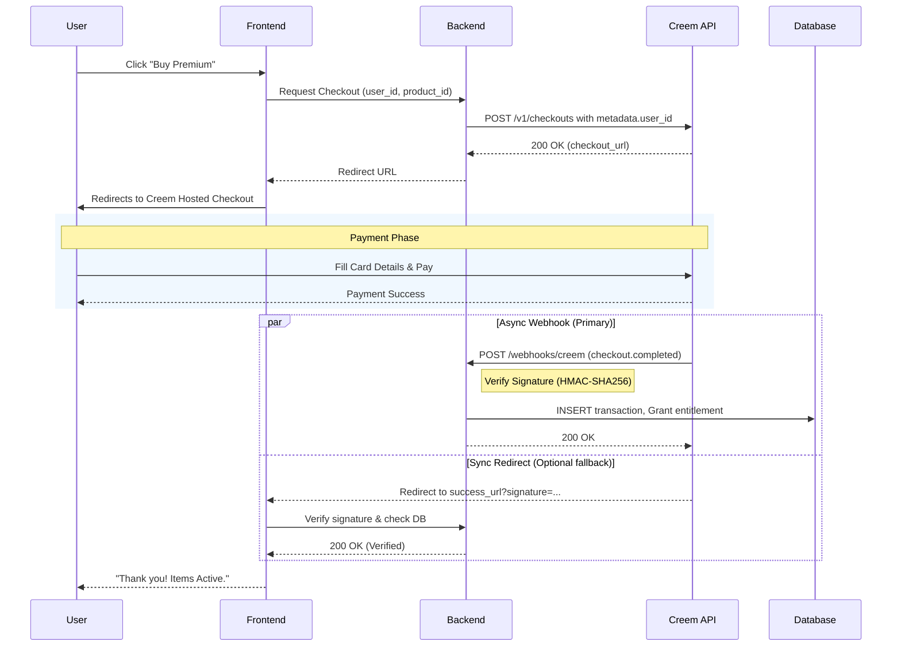

# Creem One-Time Payment Lifecycle

**Version**: 1.0  
**Last Updated**: 2026-03-04  
**Scope**: Creem API v1 (Checkouts & Webhooks)

This document outlines the lifecycle of One-Time Payments in the Creem system, and how this backend handles them.

## Overview

One-Time Payments are distinct from Subscriptions in Creem. They are paid for once and do not auto-renew.
They represent a single transaction between the user and your product.

**Current Implementation**: Treated as **Non-Consumable** (Permanent Unlock).

## The Flow vs Google Play

Unlike Google Play (where the mobile app handles payment UI natively and sends a token to the backend for verification), Creem handles the entire checkout process via a hosted **Checkout Session**.
There is no "3-Day Rule" for acknowledgement. Payment completion is definitive.

## Current API: v1

This implementation uses the Creem v1 API:

| Operation | Endpoint | Status |
|-----------|----------|--------|
| Create checkout | `POST /v1/checkouts` | ✅ v1 |
| Webhook events | `POST /webhooks/creem` | ✅ v1 |

## Lifecycle Flow

### 1. Purchase Initiation (Frontend/Backend)
*   User clicks "Buy" in the app or website.
*   Backend creates a new **Checkout Session**:
    *   API: `POST /v1/checkouts` (or `creem.checkouts.create` via SDK)
    *   Parameters: `product_id`, `success_url`
    *   **Security**: Backend MUST attach `metadata.user_id` (or similar identifier) to map the payment to the internal user.
*   **Result**: Backend receives a `checkout_url` and redirects the user to it.
    *   **Tip**: Use the `@creem/sdk` or `creem_io` packages for type-safe interaction.

### 2. User Checkout
*   User completes payment on the Creem-hosted checkout page.
*   Upon success, the user is redirected back to the `success_url` provided during session creation.
*   The redirect URL includes query parameters: `checkout_id`, `order_id`, `customer_id`, `product_id`, `request_id`, and `signature`.

### 3. Verification & Fulfillment (Webhook / Redirect)

#### Method A: Webhook (Primary Source of Truth)
*   Creem sends a `checkout.completed` webhook to `POST /webhooks/creem`.
*   **Verification**: The backend verifies the webhook payload signature using the HMAC-SHA256 `creem-signature` header against the `CREEM_WEBHOOK_SECRET`.
*   **Fulfillment**: The backend reads `metadata.user_id` from the payload, records the transaction in the `payments` table, and grants the entitlement (`is_premium=true`, etc.).

#### Method B: Synchronous Redirect Verification
*   When the user lands on the `success_url`, the backend can parse and verify the `signature` query parameter to immediately confirm payment.
*   The signature is composed of the other query parameters signed using the API key.
*   **Idempotency**: The backend must handle potential race conditions between the redirect and the webhook to avoid double-fulfillment.

### 4. Data Persistence
*   Backend records the transaction in the `payments` table, storing the `transaction_id` or `order_id`.
*   Backend grants the entitlement for the product.

### 5. Handling Refunds
*   Refunds can be initiated via the Creem Dashboard or API.
*   **Real-Time Notification**: Creem sends a `refund.created` webhook when a full or partial refund is processed.
*   **Action**: When receiving `refund.created`, the backend finds the corresponding transaction, updates its status to `refunded`, and revokes entitlements if applicable.

## Diagram

## Error Handling & Edge Cases

### Payment Statuses
*   **Pending**: Checkout initiated but not completed. User might have abandoned the checkout.
*   **Paid**: Payment successful.
*   **Refunded**: Payment fully refunded.
*   **Partially Refunded**: Payment partially refunded.

### Webhook Retries
If the backend fails to respond with a 2xx status (e.g., 500 error), Creem will retry delivering the webhook at:
*   30 seconds
*   1 minute
*   5 minutes
*   1 hour

### Test Mode
*   Use `https://test-api.creem.io/v1` instead of `https://api.creem.io/v1`.
*   Use test mode specific API Keys and Webhook Secrets from the dashboard.
*   Test cards (e.g., `4242 4242 4242 4242`) simulate successful and failed payments without real charges.

## Summary Checklist

- [ ] Route one-time purchases to Creem Checkout creation API
- [ ] Ensure `metadata.user_id` is passed correctly on checkout creation
- [ ] Implement robust webhook handler validating HMAC-SHA256 `creem-signature`
- [ ] Handle `checkout.completed` event to grant entitlements
- [ ] Handle `refund.created` event to revoke entitlements
- [ ] Ensure idempotency for concurrent webhook and redirect verifications
