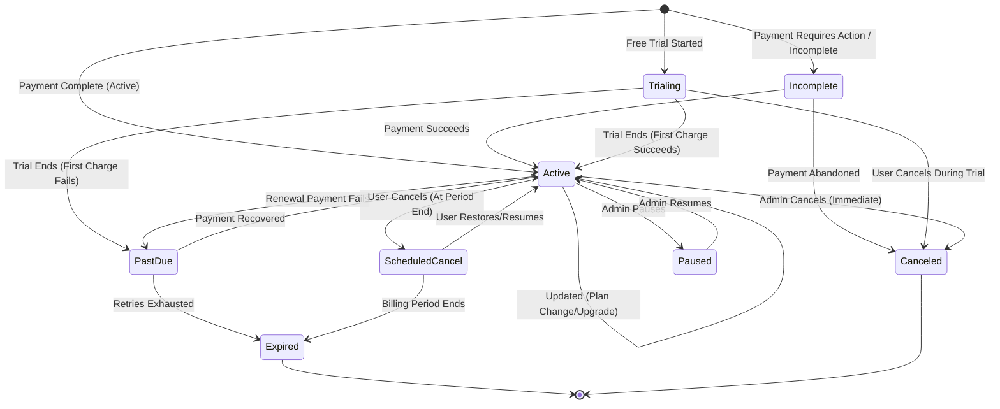

# Creem Subscription Lifecycle

**Version**: 1.0  
**Last Updated**: 2026-03-04  
**Scope**: Creem API v1 (Checkouts, Webhooks, Subscriptions)

This document outlines the lifecycle of Auto-Renewing Subscriptions in the Creem system and how the backend handles them.

## Overview

Subscriptions in Creem represent a recurring payment agreement between you and your customer. Creem automatically handles billing cycles, payment retries, customer management, upgrades, and cancellations. The backend must listen to Webhooks to stay in sync with the current state of a user's subscription access.

## Key States & Transitions

### 1. New Purchase (`subscription.active`)
*   **Trigger**: User subscribes to a plan and completes the checkout successfully.
*   **Creem Status**: `active` or `paid`.
*   **Backend Action**:
    1.  Receive webhook `subscription.active` or `subscription.paid`.
    2.  Extract `customer` and `metadata.user_id`.
    3.  Create or update subscription record in DB (`status='active'`).
    4.  Grant premium access.

### 2. Incomplete Checkout (`incomplete`)
*   **Trigger**: Customer initiates checkout but payment requires additional action (e.g., 3D Secure authentication) or is not completed within the allowed window (23 hours).
*   **Creem Status**: `incomplete`.
*   **Backend Action**:
    *   No immediate webhook action needed — wait for checkout completion.
    *   If the payment succeeds, the subscription transitions to `active` (via `subscription.active` webhook).
    *   If the checkout is abandoned, the subscription transitions to `canceled`.

### 3. Free Trials (`subscription.trialing`)
*   **Trigger**: User signs up for a subscription with a free trial period. No initial payment is collected.
*   **Creem Status**: `trialing`.
*   **Backend Action**:
    *   Receive webhook `subscription.trialing`.
    *   Initialize subscription in DB with `status='trialing'`.
    *   Grant the user premium access (trials count as active access).

### 4. Renewal / Successful Payment (`subscription.paid`)
*   **Trigger**: A recurring billing cycle processes successfully.
*   **Creem Status**: `active`.
*   **Backend Action**:
    *   Receive webhook `subscription.paid`.
    *   Update `current_period_end_date` in the DB.
    *   Ensure the status remains `active`.

### 5. Payment Failure (`subscription.past_due`)
*   **Trigger**: A recurring payment fails (e.g., expired card, insufficient funds).
*   **Description**: Creem automatically retries failed payments based on its internal retry logic (Grace Period).
*   **Creem Status**: The API `SubscriptionStatus` field returns `unpaid`. The corresponding webhook event is named `subscription.past_due`.
*   **Backend Action**:
    *   Receive webhook `subscription.past_due`.
    *   Determine if access should be revoked or if a grace period is allowed.
    *   Notify the user via email or in-app messaging to update their payment method in the Customer Portal.
    *   Update DB status to `unpaid` (matching the API `SubscriptionStatus` enum value).

### 6. Expiration (`subscription.expired`)
*   **Trigger**: A subscription period ends without a successful payment (all retries exhausted).
*   **Access**: **User LOSES access**.
*   **Backend Action**:
    *   Receive webhook `subscription.expired`.
    *   Update status to `expired`.
    *   Revoke premium access.

### 7. Scheduled Cancellation (`subscription.scheduled_cancel`)
*   **Trigger**: Customer or developer cancels the subscription, but opts to configure the cancellation at the *end of the billing period*.
*   **Cancel API Detail**: `POST /v1/subscriptions/{id}/cancel` with `mode: "scheduled"`. The `onExecute` parameter controls what happens at period end: `"cancel"` (default) transitions to canceled/expired, while `"pause"` pauses the subscription instead.
*   **Access**: **User RETAINS access** until the end date.
*   **Resuming**: The user (or admin) can restore a scheduled cancellation before the period ends via `POST /v1/subscriptions/{id}/resume`, which transitions the subscription back to `active`.
*   **Backend Action**:
    *   Receive webhook `subscription.scheduled_cancel`.
    *   Update `auto_renewing = false`.
    *   Keep status `active` until the end date. Let the future `subscription.expired`, `subscription.canceled`, or `subscription.paused` (if `onExecute: "pause"`) handle the revocation.

### 8. Immediate Cancellation (`subscription.canceled`)
*   **Trigger**: Subscription is manually and immediately canceled via the Dashboard, API, or Customer Portal (if configured for immediate).
*   **Access**: **User LOSES access** (or retains until the end of the period, depending on your strict cancellation policy).
*   **Backend Action**:
    *   Receive webhook `subscription.canceled`.
    *   Update status to `canceled`.
    *   Revoke premium access (if immediate).

### 9. Paused (`subscription.paused`)
*   **Trigger**: Subscription is temporarily paused via the Dashboard or API. No charges are processed and billing is on hold.
*   **Access**: **User LOSES access**.
*   **Backend Action**:
    *   Receive webhook `subscription.paused`.
    *   Update status to `paused`.
    *   Revoke premium access.

### 10. Upgrades / Downgrades (`subscription.update`)
*   **Trigger**: Customer changes their plan (e.g., Monthly to Yearly) via the Customer Portal or API.
*   **Proration Options**:
    *   `proration-charge-immediately`: Calculates prorated amount, charges immediately, starts new cycle.
    *   `proration-charge`: Calculates prorated amount as credit and adds to next invoice.
    *   `proration-none`: No proration. Effective next cycle.
*   **Backend Action**:
    *   Receive webhook `subscription.update` (or track changes if handling via SDKs).
    *   Update the `product_id`, seat count (if applicable), and current period dates in DB.

### 11. Refunds (`refund.created`)
*   **Trigger**: A full or partial refund is initiated for a subscription payment.
*   **Backend Action**:
    *   Receive webhook `refund.created`.
    *   Determine if the subscription is still valid or if access needs immediate revocation based on your refund policy.

## Subscription Lifecycle Diagram

## Backend Implementation Details

### The Access Management Abstraction

Creem provides a mental model around two core concepts: **Granting Access** and **Revoking Access**. Instead of strictly mapping every detailed HTTP webhook state, the backend can safely group the webhooks:

*   **Events to GRANT access**:
    *   `subscription.active`
    *   `subscription.trialing`
    *   `subscription.paid`
    *   (Note: `scheduled_cancel` does NOT revoke access until the period actually ends)
*   **Events to REVOKE access**:
    *   `subscription.paused`
    *   `subscription.expired`
    *   (And optionally `subscription.canceled`, depending on strict business logic)

### Checkout and User Context

*   **Endpoint**: New subscriptions are created by initializing a Creem Checkout session (`POST /v1/checkouts` where `billing_type` is recurring).
*   **User Association**: ALWAYS pass `metadata.user_id` (or similar `reference_id`) when creating the checkout. This metadata guarantees the backend can tie the resulting webhooks to the correct user.
*   **Retrieving Context**: Webhook payloads contain a `metadata` dictionary on the subscription object.

### The Customer Portal

Unlike Google Play where subscriptions are managed natively in the Play Store app, Creem checkouts are managed via the **Customer Portal**:
*   To allow users to cancel, upgrade, or update their payment method, redirect them to a Portal Link.
*   API: `POST /v1/customers/billing` (or `/v1/customer-portal`) with payload `{ "customer_id": "cust_YOUR_CUSTOMER_ID" }`.
*   SDK: `await creem.customers.createPortal({ customerId: '...' })`

### Security and Verification

*   **Secret API Key**: Used to authenticate backend requests to the Creem API (e.g., generating checkout sessions and portals).
*   **Webhook Secret**: Used to cryptographically verify payload authenticity.
*   **Signature Header**: `creem-signature`
*   **Algorithm**: HMAC-SHA256 of the raw payload string using the Webhook Secret.
*   **Requirement**: Never process a webhook without validating its signature to prevent spoofing.

## Testing & Environments

### Test Mode Isolation
*   Test mode and production environments are strictly separated.
*   API Endpoint: `https://test-api.creem.io/v1` vs `https://api.creem.io/v1`.
*   Data generated in test mode is isolated. API Keys and Webhook Secrets differ by environment.

### Test Cards
Provide predictable results for testing webhooks:
*   `4242 4242 4242 4242`: Successful payment
*   `4000 0000 0000 0002`: Card declined (simulates `subscription.past_due`)
*   `4000 0000 0000 0069`: Expired card

## Comparison: Google Play vs Creem

| Feature | Google Play (v2) | Creem (v1) |
| :--- | :--- | :--- |
| **Source of Truth** | Polling via RTDNs + API GET limits | Direct Webhooks (`POST /webhooks/creem`) |
| **User Binding** | `obfuscatedExternalAccountId` | Custom `metadata` keys on Checkout |
| **Acknowledgement** | Strict 3-day acknowledgement required | None. Webhooks arrive confirmed. |
| **Customer Actions** | Play Store app | Hosted Customer Portal |
| **State Machine** | Highly complex, nested contexts | Direct statuses (`active`, `past_due`) |
| **Security Validation** | Base64 decode + RSA Signature | HMAC-SHA256 signature (`creem-signature`) |

## Summary Checklist

- [ ] Create Checkouts with `metadata.user_id`
- [ ] Implement signature verification for `creem-signature`
- [ ] Map `subscription.active`, `trialing`, `paid` -> **Grant Access**
- [ ] Map `subscription.paused`, `expired` -> **Revoke Access**
- [ ] Map `subscription.scheduled_cancel` -> Update auto-renew state, keeping access active
- [ ] Connect "Manage Subscription" buttons to the Creem Customer Portal API
- [ ] Configure Creem Webhooks in the Dashboard settings
- [ ] (Advanced) Implement "Heartbeat" store monitoring to track health and sales volume proactively.

## Monitoring & "Heartbeat"
Creem supports a periodic "Heartbeat" routine where AI agents or background scripts can query the API to detect state changes without waiting for webhooks.
*   **Query**: `creem subscriptions list --status past_due --json`
*   **Alert**: Use this to proactively notify your team of payment issues before the `subscription.expired` event occurs.

