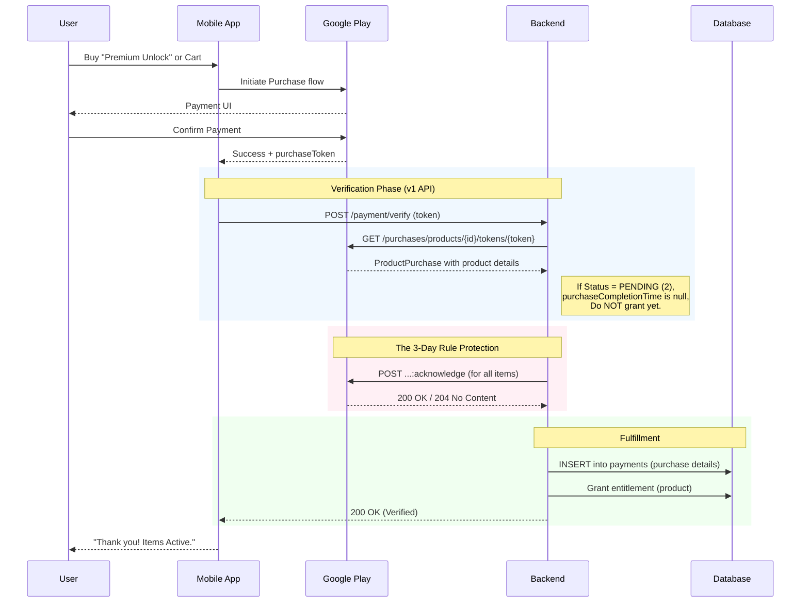

# Google Play One-Time Product (OTP) Lifecycle

**Version**: 1.1  
**Last Updated**: 2026-01-08  
**Scope**: Google Play Billing API v1 (purchases.products)

This document outlines the lifecycle of One-Time Products (In-App Purchases) in the Google Play Billing system, and how this backend handles them.

## Overview

One-Time Products (OTPs) are distinct from Subscriptions. They are paid for once and do not auto-renew.
There are two types of OTPs:
1.  **Non-Consumable**: Purchased once and permanently owned (e.g., "Remove Ads", "Premium Upgrade").
2.  **Consumable**: Purchased, used, and can be purchased again (e.g., "100 Coins").

**Current Implementation**: Treated as **Non-Consumable** (Permanent Unlock).

## The 3-Day Rule (Critical)
Google Play requires that all purchases be **Acknowledged** or **Consumed** within **3 days** of the purchase.
> [!WARNING]
> If a purchase is not acknowledged or consumed within 3 days, Google Play will automatically **refund** the purchase and revoke the item.

## Current API: v1 (purchases.products)

This implementation uses `purchases.products` v1 API:

| Operation | Endpoint | Status |
|-----------|----------|--------|
| Get purchase details | `purchases.products.get` | ✅ v1 |
| Acknowledge purchase | `purchases.products.acknowledge` | ✅ v1 |
| Consume purchase | `purchases.products.consume` | ✅ v1 |

**Note**: Google's `purchases.productsv2` (v2 API) exists but is **incomplete** - it only offers `getproductpurchasev2` (retrieval). Write operations (acknowledge, consume) remain v1-only. See Future scope for v2 migration planning.

## Lifecycle Flow

### 1. Purchase Initiation (Mobile App)
*   User clicks "Buy" in the app.
*   **Security**: App **MUST** set `obfuscatedExternalAccountId` to a hash of the user's internal ID (e.g., SHA-256 of `user_uuid`). This binds the purchase to the specific user account.
*   `cordova-plugin-purchase` (or native billing client) communicates with Google Play.
*   User completes payment.
*   **Result**: App receives a `purchaseToken` and `receipt`. State is `PURCHASED` (local).

### 2. Backend Verification
*   App sends the `purchaseToken` and `productId` to the backend endpoint:
    *   `POST /api/v1/payment/verify`
*   Backend authenticates the user and routes the request to `GooglePlayProvider`.

### 3. Server-Side Verification
*   Mobile app sends `purchaseToken` and `productId` to backend for routing.
*   Backend calls Google Play API:
     *   `GET /androidpublisher/v3/applications/{pkg}/purchases/products/{id}/tokens/{token}` (API Name: `purchases.products.get`)
     *   **Checks**:
     *   **Security Critical**:
         *   Verify `obfuscatedExternalAccountId` matches the hash of the currently authenticated user's ID. **If mismatch: Rejected.**
         *   **Price & Offer Verification**: Extract `offerTags[]`, `offerId`, and `purchaseOptionId` from each line item and verify against your internal product catalog. Check `quantity` matches expected purchase to prevent fraud.
         *   Verify that `productId` in each line item matches your expected products.
     *   **Purchase State**: Check `purchaseStateContext.purchaseState` for the overall purchase:
         *   If `PURCHASED` (value: `0`): Proceed with fulfillment.
         *   If `CANCELLED` (value: `1`): Do not grant. Log and return error.
         *   If `PENDING` (value: `2`): Do not grant entitlements yet. Payment is pending (e.g., cash, slow card, bank transfer). Backend should retry periodically or wait for RTDN notification when state changes to `PURCHASED`.
     *   **Consumption State**: For each `productLineItem[]`, check `productOfferDetails.consumptionState`:
         *   `CONSUMPTION_STATE_YET_TO_BE_CONSUMED`: Item not yet consumed
         *   `CONSUMPTION_STATE_CONSUMED`: Item already consumed
     *   **Acknowledgement State**: Check `acknowledgementState`:
         *   If `ACKNOWLEDGEMENT_STATE_PENDING`: Proceed to Step 4.
         *   If `ACKNOWLEDGEMENT_STATE_ACKNOWLEDGED`: **Idempotency Check**. Check internal DB. If already recorded, return Success immediately. Do not attempt to acknowledge again (will fail with 400).
     *   **Purchase Completion Time**: `purchaseCompletionTime` is **only populated when state = PURCHASED**. For PENDING purchases, this field is absent. Do not grant entitlements until this timestamp exists - it confirms payment was successfully processed.
     *   **Regional Information**: The API returns `regionCode` (ISO 3166-1 alpha-2) useful for tax compliance and pricing strategy.
     *   **Single Product per Purchase** (Current Implementation): The response contains a single product. Multi-item cart support is deferred (see Future scope).

### 4. Acknowledgement (Backend Action)
*   **Crucial Step**: Upon successful verification, the Backend **must** tell Google "We have delivered the item".
*   For **non-consumable** purchases:
    *   Backend calls: `POST /androidpublisher/v3/applications/{pkg}/purchases/products/{productId}/tokens/{token}:acknowledge`
    *   ⚠️ Note: Use v1 path `purchases.products` (not `productsv2`) - `purchases.productsv2.acknowledge` doesn't exist yet. This v1 endpoint correctly acknowledges ALL line items in the purchase.
*   For **consumable** purchases (future implementation):
    *   Call `POST /androidpublisher/v3/applications/{pkg}/purchases/products/{productId}/tokens/{token}:consume`
    *   Must consume each product individually by its productId.
*   **Idempotency**: The API is naturally idempotent (returns 400 "already acknowledged" if called twice). Consider implementing additional idempotency checks in your backend to avoid unnecessary API calls.
*   **Timeline**: The 3-day acknowledgement window starts from the `purchaseCompletionTime` (not receipt by backend). Acknowledge as soon as possible.
*   This marks the transaction as complete on Google's side. Prevents the 3-day auto-refund.

### 5. Data Persistence
*   Backend records the transaction in the `payments` table.
*   Backend grants the entitlement for the product (e.g., sets `is_premium=true`, adds coins, etc.).
*   Track the purchase state and token for future lookups.

### 6. Handling Revocations (Refunds)

#### Primary Method: Real-Time Developer Notifications (RTDN)
Users may request refunds through Google Customer Support after the purchase.
*   **Real-Time (Strongly Recommended)**: Listen for **RTDN** (Real-Time Developer Notifications) via Cloud Pub/Sub. This is the primary source of truth for lifecycle changes.
     *   **CRITICAL RTDN Configuration**: 
         *   In Play Console → Monetization Setup → Real-time developer notifications:
         *   Enable "Real-time developer notifications"
         *   **MUST explicitly check** "Get all notifications for subscriptions and one-time products"
         *   ⚠️ **Default settings only send subscription notifications**
         *   Without this checkbox, you will NOT receive `ONE_TIME_PRODUCT_PURCHASED` or `ONE_TIME_PRODUCT_CANCELED` RTDNs
     *   Notification Types:
         *   `ONE_TIME_PRODUCT_PURCHASED`: Purchase completed successfully
         *   `ONE_TIME_PRODUCT_CANCELED`: Purchase refunded or cancelled
*   **Action**: When receiving `ONE_TIME_PRODUCT_CANCELED`, call `purchases.products.get` to get the latest state, then revert the entitlements.

#### Fallback Method: Voided Purchases API
*   **Passive Check**: Periodically call the [Voided Purchases API](https://developers.google.com/android-publisher/voided-purchases) to identify refunded orders.
*   ⚠️ Note: This API has quota limits and only includes purchases that were in `PURCHASED` state before being refunded.
*   Use this as a backup mechanism if RTDN delivery fails or for periodic reconciliation.

### 7. Pre-Order Handling
When a pre-order is fulfilled and payment completes:
*   Google sends `ONE_TIME_PRODUCT_PURCHASED` RTDN
*   `purchaseState` changes from `PENDING` to `PURCHASED`
*   `purchaseCompletionTime` is populated
*   Process exactly like a normal purchase (verify, acknowledge, grant entitlements)

## Diagram

## Error Handling & Retries

### Acknowledgement Failures

| Error Code | Meaning | Action |
|---|---|---|
| `400 Bad Request` | Purchase already acknowledged | Treat as success (idempotency check will catch this) |
| `401 Unauthorized` | Invalid credentials / service account | Verify Google Play service account and key file |
| `403 Forbidden` | Service account lacks permissions | Verify IAM roles for `androidpublisher` API |
| `404 Not Found` | Invalid package name, product ID, or token | Verify inputs; token may have expired |
| `409 Conflict` | Purchase in inconsistent state (concurrent updates) | Retry after delay or check revocation status. Can occur when both BillingClient and backend try to acknowledge simultaneously |
| `500/503` | Google Play service error | Implement exponential backoff retry (max 3 attempts) |

### Retry Strategy
*   **Transient Errors** (500, 503, 409): Retry with exponential backoff (1s, 2s, 4s)
*   **Permanent Errors** (400 with "already acknowledged", 404): Log and return success/fail accordingly. Do not retry.
*   **Network Timeouts**: Retry with backoff; consider a background job for retry if immediate retry fails

### PENDING State Handling
If `purchaseState = PENDING`:
*   Do NOT grant entitlements.
*   `purchaseCompletionTime` will be absent.
*   Option 1: Implement a background job to periodically poll the purchase status via `purchases.productsv2.getproductpurchasev2`.
*   Option 2: Rely on RTDN notifications to detect when status changes to `PURCHASED` (recommended).
*   Return `202 Accepted` to the mobile app indicating "payment pending, please wait".

## Linked Purchases
Google Play tracks `linkedPurchaseToken` for related purchases (e.g., subscription renewals, upgrades). For one-time products, this field is typically `null` and can be ignored.

## Consumables (Future Scope)
If we sell "Coins" or other consumable items in the future, the flow changes slightly at Step 4:
*   Instead of `acknowledge`, we **MUST** use `consume`.
    *   API: `POST /androidpublisher/v3/applications/{pkg}/purchases/products/{productId}/tokens/{token}:consume`
*   **Difference**: Acknowledging a consumable does *not* make it available for re-purchase. Only `consume` does.
*   **For Multi-Item Consumables**: Each product in the cart must be consumed individually by its `productId`.
*   **Current Backend**: Only supports `acknowledge`. Logic must be updated if Consumables are introduced.

## Testing "Gotcha"
*   **License Testers Window**: For accounts configured as License Testers in Play Console, the "3-day acknowledgement window" is compressed to roughly **5 minutes**.
*   **Risk**: If your backend fails to acknowledge a test purchase within 5 minutes, it will be auto-refunded. This can look like a random bug. Ensure your dev environment acknowledges immediately.
*   **Test Purchase Detection**: Use the `testPurchaseContext` field in the API response to identify test purchases.

## Deprecations & Source of Truth
*   `BillingClient.queryPurchaseHistory()` is effectively deprecated/removed in modern best practices.
*   **Impact**: You cannot rely on Google Play to store the user's "history".
*   **Requirement**: The Backend `payments` table is the **primary source of truth** for what the user owns. "Restore Purchases" logic in the app should query the *Backend*, not Google Play (except to refresh active tokens and detect new purchases).

## Future Scope: Multi-Item Cart Support (v2 API)

When multi-item purchases are implemented:
*   Migrate from `purchases.products.get` to `purchases.productsv2.getproductpurchasev2` for retrieval
*   Add support for iterating through `productLineItem[]` array (v2 includes multi-item support)
*   Handle `quantity` field for each line item
*   Track `refundableQuantity` for partial refund support
*   Update database schema to store multiple line items per purchase token
*   Note: Acknowledgement endpoint will remain `purchases.products.acknowledge` (v2 version not yet available)

## Summary Checklist

- [ ] Use `purchases.products.get` API for verification
- [ ] Verify `obfuscatedExternalAccountId` matches user
- [ ] Check `purchaseState = PURCHASED` and `purchaseCompletionTime` exists
- [ ] Validate product ID and purchase details
- [ ] Acknowledge within 3 days (5 minutes for test purchases)
- [ ] Enable RTDN with "Get all notifications for subscriptions and one-time products"
- [ ] Handle `ONE_TIME_PRODUCT_CANCELED` RTDNs for refunds
- [ ] Implement proper error handling and retries
- [ ] Backend is source of truth for user entitlements

## Specific deffered work

Check `GOOGLE_PLAY_BILLING_DEFERRALS.md` for the list of not in scope cappabilities for the current BE implementation.
