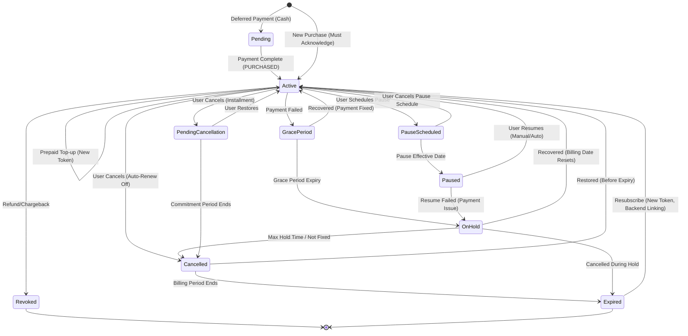

# Google Play Subscription Lifecycle

**Version**: 1.1  
**Last Updated**: 2026-05-23
**Scope**: Google Play Billing API v2

This document outlines the lifecycle of Auto-Renewing Subscriptions in the Google Play Billing system and how the backend handles them.

## Overview

Subscriptions are complex because they have a persistent state that changes over time without user interaction (e.g., renewals, expiration, payment failures). The backend must listen to Real-Time Developer Notifications (RTDN) to stay in sync.

## Key States & Transitions

### 1. New Purchase (`SUBSCRIPTION_PURCHASED`)
*   **Trigger**: User buys a subscription for the first time, or **Re-subscribes** after expiration.
*   **Google Status**: `SUBSCRIPTION_STATE_ACTIVE`.
*   **Note**: If it's a Resubscribe after expiration, see section #12 for special handling requirements.
*   **Backend Action**:
    1.  Verify the token.
    2.  **Acknowledge** the purchase (Critical 3-day rule).
    3.  Create subscription record in DB (`status='active'`).
    4.  Grant premium access.

### 2. Renewal (`SUBSCRIPTION_RENEWED`)
*   **Trigger**: Recurring billing cycle processes successfully.
*   **Google Status**: `SUBSCRIPTION_STATE_ACTIVE`.
*   **For Installment Plans**: RTDN sent for each billing date charge.
*   **Renewal Date Handling**: If subscription renews on 29th, 30th, or 31st going into February (non-leap year), renewal moves to 28th and stays on 28th for the duration.
*   **Backend Action**:
    *   Receive webhook `SUBSCRIPTION_RENEWED`.
    *   **Do NOT** acknowledge again (only initial purchase needs it).
    *   Update `current_period_end` in DB.
    *   Ensure status remains `active`.

### 3. Grace Period (`SUBSCRIPTION_IN_GRACE_PERIOD`)
*   **Trigger**: Payment failed (e.g., expired card), but Google is retrying.
*   **Description**: Google gives the user extra time (e.g., 7-14 days) to fix the payment.
*   **Access**: **User RETAINS access**.
*   **Backend Action**:
    *   Keep status as `active` (or `past_due` but granting access).
    *   Use In-App Messaging API to notify user.
    *   Google dynamically extends `expiryTime` during grace period.

#### 3.1. Silent Grace Period (Minimum 24 Hours)
*   **Critical Note**: Even if Grace Period is disabled (set to 0 days), Google enforces a minimum **24-hour "Silent Grace Period"**.
*   **During Silent Grace Period**:
    *   Subscription remains in `SUBSCRIPTION_STATE_ACTIVE`.
    *   **No RTDN is sent** during these first 24 hours.
    *   Google makes additional payment retry attempts.
*   **After Silent Grace Period (24 hours)**:
    *   You receive ONE of these RTDNs based on outcome:
        *   `SUBSCRIPTION_ON_HOLD` (if account hold enabled)
        *   `SUBSCRIPTION_CANCELED` (if canceled)
        *   `SUBSCRIPTION_EXPIRED` (if expired)
        *   `SUBSCRIPTION_RENEWED` (if successfully renewed)
*   **Best Practice**: Call `purchases.subscriptionsv2.get()` when you receive the RTDN (not at expiry time) to get accurate status.

### 4. Account Hold (`SUBSCRIPTION_ON_HOLD`)
*   **Trigger**: Grace period ended, payment still failed, OR subscription resumes from pause with failed payment.
*   **Description**: Subscription is suspended.
*   **Access**: **User LOSES access**.
*   **Default Setting**: Enabled by default. Duration = 60 days minus grace period duration.
*   **Backend Action**:
    *   Update status to `on_hold` (or `inactive`).
    *   Revoke premium access.
    *   Use In-App Messaging API to notify user.
    *   `expiryTime` is set to a past timestamp.
    *   Handle any cancellations/restorations/repurchases during this period.

### 5. Recovery (`SUBSCRIPTION_RECOVERED`)
*   **Trigger**: User fixed payment method during Grace Period or Account Hold.
*   **Billing Date Behavior**:
    *   Grace Period Recovery: Billing date **does NOT reset** (keeps original cycle).
    *   Account Hold Recovery: Billing date **resets** to recovery date.
*   **Backend Action**:
    *   Update status to `active`.
    *   Reset `current_period_end` based on recovery context.
    *   Restore premium access.

### 6. Cancellation (`SUBSCRIPTION_CANCELED`)
*   **Trigger**: User turns off auto-renewal, or fails to recover from account hold.
*   **Description**: Access continues until the end of the current billing cycle.
*   **Installment Subscriptions**: See section #6.1 below.
*   **Backend Action**:
    *   Update `auto_renewing = false`.
    *   Keep status `active` until `expiryTime`.
    *   At `expiryTime`, status becomes `expired`.
    *   Check `canceledStateContext` field to understand cancellation reason (user vs system vs developer).
    *   Check `userInitiatedCancellation` for user's stated reason.

#### 6.1. Installment Subscription Cancellation
*   **User-Initiated Cancellation**:
    *   RTDN: `SUBSCRIPTION_CANCELLATION_SCHEDULED` (when commitment period has remaining payments).
    *   Subscription remains `SUBSCRIPTION_STATE_ACTIVE` until end of commitment.
    *   Subscription resource includes `pendingCancellation` object.
    *   At commitment end: `SUBSCRIPTION_CANCELED` then `SUBSCRIPTION_EXPIRED`.
*   **Developer-Initiated Cancellation**:
    *   Using `purchases.subscriptionsv2.cancel` API:
        *   `cancellationType = USER_REQUESTED_STOP_RENEWAL`: Cancels at end of commitment.
        *   `cancellationType = DEVELOPER_REQUESTED_STOP_PAYMENTS`: Stops next payment immediately.

### 7. Expiration (`SUBSCRIPTION_EXPIRED`)
*   **Trigger**: Subscription ended (cancelled and period finished, or payment failed significantly).
*   **Access**: **User LOSES access**.
*   **Backend Action**:
    *   Update status to `expired`.
    *   Revoke premium access.

### 8. Paused (`SUBSCRIPTION_PAUSED` / `SUBSCRIPTION_PAUSE_SCHEDULE_CHANGED`)
*   **Trigger**: User pauses subscription (1 week to 3 months, depending on recurrence).
*   **Default Setting**: Enabled by default. Can be disabled in Play Console.
*   **Available Pause Lengths**:
    *   Weekly: 1-4 weeks
    *   Monthly: 1-3 months
    *   Three-month/Six-month: 1-3 months
    *   Annual: N/A (pause not available)
*   **Process**:
    1.  **Schedule**: `SUBSCRIPTION_PAUSE_SCHEDULE_CHANGED`. User retains access. `subscriptionState = SUBSCRIPTION_STATE_ACTIVE`, `autoRenew=true`.
    2.  **Effect**: `SUBSCRIPTION_PAUSED` at renewal time. User **LOSES** access. `subscriptionState = SUBSCRIPTION_STATE_PAUSED`.
    3.  **Resume**: `SUBSCRIPTION_RECOVERED` (auto or manual).
    4.  **Failed Resume**: `SUBSCRIPTION_ON_HOLD` (payment issue).
*   **Manual Resume**: User can resume anytime during pause. Billing date changes to manual resume date.
*   **Backend Action**:
    *   On `PAUSE_SCHEDULE_CHANGED`: Log schedule, keep active.
    *   On `PAUSED`: Update status to `paused`, revoke access. Check `PausedStateContext` for resume time.
    *   On `RECOVERED`: Restore access, handle as recovery.
    *   On `ON_HOLD`: Handle as account hold.

### 9. Upgrades/Downgrades
*   **Trigger**: User switches plans (e.g., Monthly to Yearly).
*   **Key Data**: Payload includes `linkedPurchaseToken` pointing to old subscription.
*   **Replacement Mode**: (Billing Library 7.0+) Supports modes like `WITH_TIME_PRORATION` or `KEEP_EXISTING`.
*   **Acknowledgment Requirement**: Old subscription must be acknowledged before upgrade/downgrade is allowed.
*   **Backend Action**:
    *   Find original subscription via `linkedPurchaseToken`.
    *   Mark original as `upgraded` (inactive).
    *   Create new subscription entry.
    *   **Acknowledge** the new subscription.

### 10. Revoked (`SUBSCRIPTION_REVOKED`)
*   **Trigger**: Refund issued by Google, Chargeback, or developer-initiated revocation via `purchases.subscriptionsv2.revoke`.
*   **Access**: **User LOSES access immediately**.
*   **Backend Action**:
    *   Update status to `revoked`.
    *   Cut off access immediately (ignore expiry time).
    *   Subscription resource shows `subscriptionState = SUBSCRIPTION_STATE_EXPIRED`.

### 11. Restored (`SUBSCRIPTION_RESTARTED`)
*   **Trigger**: User re-enables auto-renew (Restores) after cancelling, but **before** expiration.
*   **Note**: This is distinct from "Resubscribe" (which happens *after* expiration).
*   **Purchase Token**: **Same** purchase token is used (not a new purchase).
*   **Requirement**: All apps must support Restore functionality.
*   **Backend Action**:
    *   Update `auto_renewing = true`.
    *   Maintain `active` status.
    *   Clear all cancellation fields from subscription resource.
    *   Stop displaying restoration messages in app.

### 12. Resubscribe After Expiration (`SUBSCRIPTION_PURCHASED`)
*   **Trigger**: User re-purchases an expired subscription from Play Store (if base plan configured to allow Resubscribe).
*   **Configuration**: Must be enabled per base plan in Play Console or via API.
*   **Purchase Token**: **New** purchase token is issued (this is a new purchase).
*   **Critical Backend Handling Required**:
    1.  Receive `SUBSCRIPTION_PURCHASED` RTDN with new purchase token.
    2.  Call `purchases.subscriptionsv2.get` with new token.
    3.  Response includes `externalAccountIdentifiers` field:
        *   `obfuscatedAccountId` and `obfuscatedProfileId`: Matched from previous expired subscription (if they were set).
    4.  Use these identifiers to look up and link new purchase to correct user account.
    5.  Call `purchases.subscriptions.acknowledge` within 3 days to prevent automatic refund.
    6.  Optionally send user's `obfuscatedAccountId` and `obfuscatedProfileId` in acknowledgment.
*   **Note**: `linkedPurchaseToken` may be present for upgrades/crossgrades but Resubscribes typically rely on `externalAccountIdentifiers` for user linking.

### 13. Deferred (`SUBSCRIPTION_DEFERRED`)
*   **Trigger**: Developer manually extends the expiry time (e.g., as a promotion or apology).
*   **API**: Use `purchases.subscriptions.defer` to advance next billing date.
*   **For Prepaid Plans**: Can defer expiration time.
*   **Backend Action**:
    *   Update `expiryTime` in DB.
    *   Maintain `active` status.
    *   Ensure user access continues until new date.
    *   During deferral: user has full access but is not charged.

### 14. Price Change (`SUBSCRIPTION_PRICE_CHANGE_UPDATED`, deprecated `SUBSCRIPTION_PRICE_CHANGE_CONFIRMED`)
*   **Trigger**: Developer changes the base plan price, or the user's price-change status changes.
*   **Primary RTDN**: `SUBSCRIPTION_PRICE_CHANGE_UPDATED`.
    *   Sent when a price change is added.
    *   Sent when the price-change status is updated, including user confirmation/rejection cases.
*   **Deprecated RTDN**: `SUBSCRIPTION_PRICE_CHANGE_CONFIRMED` (`notificationType: 8`).
    *   Google marks this notification type as deprecated.
    *   It can still be received for compatibility, but backend logic must not rely on it as the primary signal that a new price was accepted or charged.
*   **Types**:
    *   **Price Decrease**: Applies automatically.
    *   **Opt-in Price Increase**: User must accept before the higher price applies.
    *   **Opt-out Price Increase**: User is notified and can opt out/cancel before the higher price applies.
*   **Source of Truth**: After any price-change RTDN, call `purchases.subscriptionsv2.get()` and read:
    *   `lineItems[].autoRenewingPlan.priceChangeDetails.newPrice`
    *   `lineItems[].autoRenewingPlan.priceChangeDetails.priceChangeMode`
    *   `lineItems[].autoRenewingPlan.priceChangeDetails.priceChangeState`
    *   `lineItems[].autoRenewingPlan.priceChangeDetails.expectedNewPriceChargeTime`
*   **Current `priceChangeState` values**:
    *   `OUTSTANDING`: Waiting for user action/review.
    *   `CONFIRMED`: Price change is confirmed and waiting to take effect.
    *   `APPLIED`: New price has taken effect.
    *   `CANCELED`: Price change was canceled.
*   **Backend Action**:
    *   On `PRICE_CHANGE_UPDATED`: Persist ordinary price-change details separately from KR price step-up consent fields.
    *   For `OUTSTANDING`: Keep subscription access unchanged and expose pending review details to the app/UI.
    *   For `CONFIRMED`: Keep subscription access unchanged; keep or update pending details until the new price takes effect.
    *   For `APPLIED` or `CANCELED`: Clear/update pending price-change fields as appropriate.
    *   On `PRICE_CHANGE_CONFIRMED`: Log for compatibility only; do not use it alone to mark the new price as charged/applied.
    *   On renewal after price change: Handle as normal `SUBSCRIPTION_RENEWED`, then clear pending fields once the new recurring price is verified as applied.
    *   If user doesn't accept an opt-in increase before renewal: Receive `SUBSCRIPTION_CANCELED`.

#### 14.1. Price Step-Up Consent (KR Region Only)
*   **Regulation**: South Korean users must consent to price step-ups after free trial/intro periods.
*   **Definition**: Price step-up = price increase due to transition between offer phases (e.g., trial → regular price). This is different from developer-initiated price changes.
*   **Play Behavior**:
    *   Google Play notifies users and stores consent response.
    *   Auto-cancels subscriptions if user doesn't consent before higher price takes effect.
*   **RTDN**: `SUBSCRIPTION_PRICE_STEP_UP_CONSENT_UPDATED` (sent when consent period begins or user provides consent).
*   **Backend Action**:
    *   Monitor consent status.
    *   You can send custom notifications with link to specific management page.
    *   Handle auto-cancellation if consent not provided.

### 15. Prepaid Plans (`SUBSCRIPTION_PURCHASED` for each top-up)
*   **Trigger**: User buys a non-renewing prepaid plan or "Tops up" an existing one.
*   **Logic**:
    *   Does **not** auto-renew.
    *   Each top-up generates a **new** purchase token.
    *   Top-ups accumulate time (added to existing `expiryTime`).
    *   Cannot be canceled (only allowed to expire).
*   **Strict Acknowledgment Requirements**:
    *   Plans ≥ 1 week: Acknowledge within **3 days**.
    *   Plans < 1 week: Acknowledge within **half the duration** (e.g., 1.5 days for 3-day plan).
    *   **WARNING**: Failure to acknowledge results in:
        *   Top-up purchase revoked.
        *   **Entire remaining subscription revoked and canceled**.
        *   Full refund issued to user.
*   **Backend Action**:
    1.  Verify and **Acknowledge** every top-up token immediately.
    2.  For top-ups: response includes `linkedPurchaseToken` pointing to previous prepaid purchase.
    3.  Extend `expiryTime` by accumulating time.
    4.  Check `allowExtendAfterTime` field to know when user can purchase next top-up.
    5.  Update status to `expired` when time runs out.
    6.  Display messages in app about top-up availability.

### 16. Pending Purchases (Cash / Deferred Payment)
*   **Trigger**: User chooses a delayed payment method (e.g., Cash at convenience store, bank transfer).
*   **Google Status**: `SUBSCRIPTION_STATE_PENDING` (Initial state before payment completes).
*   **Backend Action**:
    *   **Do NOT grant access** initially.
    *   Wait for RTDN `SUBSCRIPTION_PURCHASED` (indicates payment completed successfully).
    *   Only then verify, acknowledge, and grant access.
    *   This is a distinct state before the subscription becomes active.

## Subscription Lifecycle Diagram

## Backend Implementation Details

### API Usage
*   **Primary API**: Use `purchases.subscriptionsv2` for all status checks and operations.
*   **Deprecated API**: `purchases.subscriptions.get` is deprecated (backward compatibility only). Do NOT use for new integrations.
*   **Still Active**: Other methods in `purchases.subscriptions` endpoint remain in use:
    *   `purchases.subscriptions.acknowledge`: For acknowledging purchases.
    *   `purchases.subscriptions.defer`: For deferring renewal dates.

### Purchase Token Validity
*   **Valid Duration**: From subscription signup until **60 days after expiration**.
*   **After 60 Days**: Purchase token is no longer valid for Google Play Developer API calls.
*   **Backend Implication**: Store subscription data before token expires for historical records.

### Verification & Security
*   **Endpoint**: All new purchases verified via `/api/v1/payment/verify`.
*   **Token Uniqueness Check**: Verify `purchaseToken` hasn't been used by different user ID to prevent "token sharing" fraud.
*   **Signature Verification**: Always verify the purchase signature from Google.

### Webhooks
*   **Endpoint**: All lifecycle changes handled via `POST /webhooks/google_play`.
*   **RTDN Configuration**: Must be configured in Google Play Console.
*   **Retry Logic**: Implement exponential backoff for failed webhook processing.

### Acknowledgment
*   **Critical Rule**: Must acknowledge within 3 days or Google automatically refunds.
*   **Prepaid Exception**: Plans < 1 week must be acknowledged within half the duration.
*   **Retry Queue**: Implement a retry queue with exponential backoff for failed acknowledgments.
*   **API Method**: `purchases.subscriptions.acknowledge`
*   **What to Acknowledge**: Only new purchases (initial and top-ups). Do NOT acknowledge renewals.

### Status Logic (Strict V2 Mapping)
*   **Do NOT** derive state from `paymentState` or `cancelReason` (Legacy V1 fields).
*   **Map `subscriptionState` directly**:
    *   `SUBSCRIPTION_STATE_PENDING` → `pending` (no access)
    *   `SUBSCRIPTION_STATE_ACTIVE` → `active` (grant access)
    *   `SUBSCRIPTION_STATE_IN_GRACE_PERIOD` → `active` or `past_due` (grant access)
    *   `SUBSCRIPTION_STATE_ON_HOLD` → `on_hold` (revoke access)
    *   `SUBSCRIPTION_STATE_PAUSED` → `paused` (revoke access)
    *   `SUBSCRIPTION_STATE_CANCELED` → `cancelled` (grant access until `expiryTime`)
    *   `SUBSCRIPTION_STATE_EXPIRED` → `expired` (revoke access)

### Access Control Rules
*   **Grant Access**: `ACTIVE`, `IN_GRACE_PERIOD`, `CANCELED` (before expiry)
*   **Revoke Access**: `PENDING`, `ON_HOLD`, `PAUSED`, `EXPIRED`, `REVOKED`
*   **Immediate Revocation**: `REVOKED` status requires immediate access cutoff regardless of `expiryTime`.

### User Context & Linking
*   **External Identifiers**: Use `setObfuscatedAccountId()` and `setObfuscatedProfileId()` during purchase flow.
*   **Retrieving Context**: Available in `ExternalAccountIdentifiers` object from subscription resource.
*   **Resubscribe Linking**: For out-of-app resubscribes, use `outOfAppPurchaseContext` to link to correct user.

### Installment Subscription Tracking
*   **Monitor Fields**:
    *   `installmentDetails.initialCommittedPaymentsCount`
    *   `installmentDetails.remainingCommittedPaymentsCount`
    *   `pendingCancellation` object (present when user cancels but commitment remains)

### Price Change Tracking
*   **Monitor Fields**:
    *   `lineItems[].autoRenewingPlan.priceChangeDetails.newPrice`
    *   `lineItems[].autoRenewingPlan.priceChangeDetails.priceChangeMode`
    *   `lineItems[].autoRenewingPlan.priceChangeDetails.priceChangeState`
    *   `lineItems[].autoRenewingPlan.priceChangeDetails.expectedNewPriceChargeTime`
*   **Separate Flows**:
    *   Ordinary developer-initiated price changes use `priceChangeDetails`.
    *   KR price step-up consent uses `priceStepUpConsentDetails` and `SUBSCRIPTION_PRICE_STEP_UP_CONSENT_UPDATED`.
    *   Do not reuse KR consent fields for ordinary developer-initiated price changes.

### Real-Time Developer Notifications (RTDNs)
All RTDNs to handle:
*   `SUBSCRIPTION_PURCHASED` (new and resubscribe)
*   `SUBSCRIPTION_RENEWED`
*   `SUBSCRIPTION_IN_GRACE_PERIOD`
*   `SUBSCRIPTION_ON_HOLD`
*   `SUBSCRIPTION_RECOVERED`
*   `SUBSCRIPTION_CANCELED`
*   `SUBSCRIPTION_CANCELLATION_SCHEDULED` (installments)
*   `SUBSCRIPTION_EXPIRED`
*   `SUBSCRIPTION_PAUSED`
*   `SUBSCRIPTION_PAUSE_SCHEDULE_CHANGED`
*   `SUBSCRIPTION_REVOKED`
*   `SUBSCRIPTION_RESTARTED`
*   `SUBSCRIPTION_DEFERRED`
*   `SUBSCRIPTION_PRICE_CHANGE_UPDATED` (primary price-change status signal)
*   `SUBSCRIPTION_PRICE_CHANGE_CONFIRMED` (deprecated; handle for compatibility only)
*   `SUBSCRIPTION_PRICE_STEP_UP_CONSENT_UPDATED` (KR only)

### Best Practices
*   **Call API on RTDN**: Don't wait for `expiryTime`. Call `purchases.subscriptionsv2.get()` when RTDN arrives for accurate status.
*   **Price Changes**: Use `SUBSCRIPTION_PRICE_CHANGE_UPDATED` plus `priceChangeDetails` from `purchases.subscriptionsv2.get()` as the source of truth. Do not rely on deprecated `SUBSCRIPTION_PRICE_CHANGE_CONFIRMED` to decide that the new price was charged.
*   **In-App Messaging**: Use In-App Messaging API to prompt users to fix payment issues during grace period and account hold.
*   **Deep Links**: Provide deep links to Google Play subscription management for users to update payment methods.
*   **Monitoring**: Track acknowledgment success rates and implement alerts for failures.
*   **Testing**: Use Google Play Console test accounts to simulate all lifecycle states.

## Common Pitfalls

1. **Not handling silent grace period**: Status may appear `ACTIVE` for 24 hours even when payment failed.
2. **Forgetting to acknowledge prepaid top-ups**: Results in full subscription revocation.
3. **Not linking resubscribe purchases**: New purchase tokens after expiration require backend linking via `outOfAppPurchaseContext`.
4. **Revoking access during cancellation**: User retains access until `expiryTime` even when canceled.
5. **Ignoring installment-specific RTDNs**: `SUBSCRIPTION_CANCELLATION_SCHEDULED` is distinct from `SUBSCRIPTION_CANCELED`.
6. **Missing token expiration**: Tokens expire 60 days after subscription expiration.
7. **Not resetting billing date on account hold recovery**: Billing date moves to recovery date (unlike grace period recovery).
8. **Treating price change as KR price step-up**: Ordinary developer price changes use `priceChangeDetails`; KR price step-up consent uses `priceStepUpConsentDetails` and is a separate flow.
9. **Relying on deprecated price-change confirmation**: `SUBSCRIPTION_PRICE_CHANGE_CONFIRMED` can still arrive, but `SUBSCRIPTION_PRICE_CHANGE_UPDATED` plus `subscriptionsv2.get` is the current source of truth.
